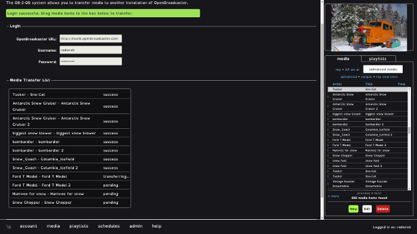

* TOC
{:toc}

## Ob2Ob module
{:toc}

{: .screenshot}

Ob2ob is a module that demonstrates communication and smart media\DB syncing between dissimilar OpenBroadcaster Server installations through the API. This can be used to distribute commercial messages, music and video libraries, PSA, User Generated Content between portals that normally don't talk with each other.

User can sync based on search results e.g. Yukon Artists, before 1990, less than 3 minutes.

Perquisites:  In order to do this a user account is needed on the target device, file formats have to be approved and the genre has to exist.

__Note: the password is never saved on the target machine but kept in temporary memory so you can submit multiple transfers.__

1. Enter in the url of the target machine, user account and password.

1. From the sidebar select media and drag and drop over to the left “”Media Transfer List”

1. Click transfer media and observe status messages.

1. When completed, click transfer more media. 

Transferred media will then be imported into target installation in the “To Be Approved” section in the sidebar under the profiles name that did the transfer while preserving the metadata and associated info.

In the example below we have successfully transferred media from one installation to a remote target. 

If trying to sync more that 1000 items, better to use Bulk Import Module

